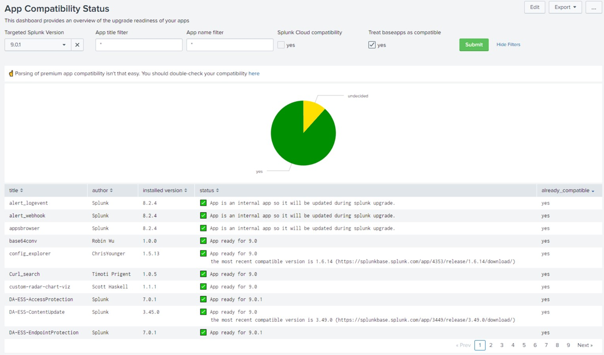

# Splunk upgrade app compatibility checker

## Which moving parts are there?
The app comes with two custom search commands.
1. `| getsplunkversions` which reaches out to doc.splunk.com to get a list of available splunk versions.
    Those are used within the "Target Splunk Version" drop down.
2. `| checkappcompatibility target_version=x.x.x` does the heavy lifting. It depends on a list of
    apps provided by splunks REST API `| rest /services/apps/local` but it is intentionally kept separated.
    To be able to reach out to the splunkbase API we need the ID's of the apps to check. Therefore
    `checkappcompatibility` looks for that information within `update.homepage`. If there is no URL provided
    it tries to retrieve the ID using the app's `title` field.
    

## How to use it?
There are three options to use the app.
1. You can use the provided dashboard which lets you check locally installed apps against a "Target Splunk Version".
2. You can use the CSC `checkappcompatibility` manually like that: `| rest /services/apps/local | checkappcompatibility target_version=8.2.1`
   if you have usecases not covered by the dashboard.
3. You can export the results of the REST call and ingest them into another splunk box to let the app check the
   status there. This comes quite handy if you prepare to upgrade an air-gapped splunk deployment. 
 

## Are there limitations?
* If you have a bunch of apps to check, splunk might auto finalize your search. To get around this split your dataset
  into multiple parts/searches.
* Sometimes splunkbase does not list multiple versions of an app. If your version is not listed, the compatibility
  can't be checked. The checker will therefore recommend to update to the most recent app version which supports your
  target splunk version.
* Obviously there a couple of apps which are not listed within the splunkbase so they cannot be checked. They will marked
  as "undecided" (see belows screenshot).
  
## How does it look?
